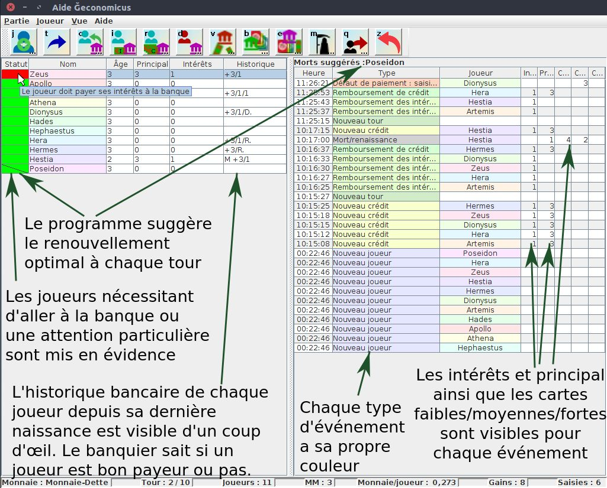
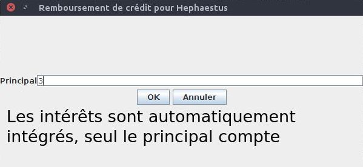
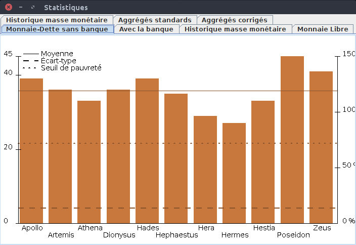
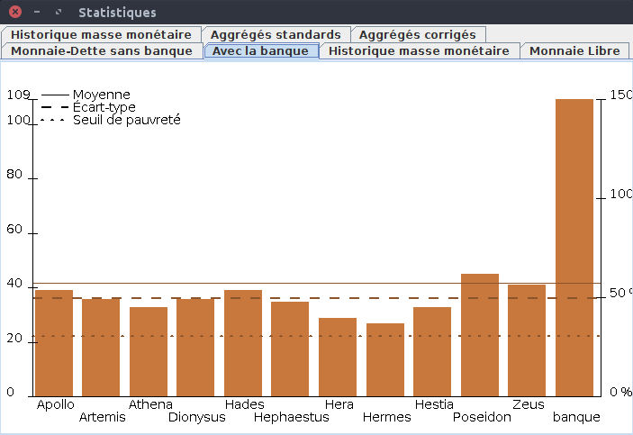
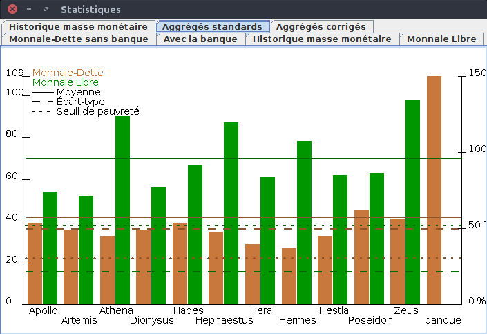

Un programme pour aider à animer les jeux Ğeconomicus, y compris pour le banquier. Il s'agit pour l'instant uniquement d'un programme pour ordinateur supportant java 8 (pas d'appli mobile).

# Introduction

Le seul prérequis est d'avoir java 8 installé sur votre machine.

L'utilisation est simple :

- lancer le programme,
- choisir une partie existante ou créer une nouvelle partie,
- enregistrer les joueurs,
- en monnaie libre, une fenêtre supplémentaire montre les couleurs des valeurs fortes et faibles en cours, pour être affichées sur un écran pour les joueurs par exemple (la rotation est automatique à chaque tour mais peut aussi être déclenchée manuellement),
- en monnaie dette, enregistrer les interactions du banquier avec les joueurs (crédits, remboursements, défauts, etc),
- gérer le renouvellement des générations (le programme conseille les renaissances en fonction du nombre de tours prévus et du nombre de joueurs) et la comptabilisation des valeurs accumulées par les joueurs,
- en fin de partie, collecter les créations de valeur de la banque et des joueurs,
- un autre écran se charge d'afficher des statistiques en comparant potentiellement plusieurs parties (idéalement avec les mêmes joueurs dans différentes monnaies).

L'accent est mis sur la rapidité d'utilisation avec des boutons accessibles (les actions sont également accessibles via des menus) et surtout des raccourcis clavier permettant d'effectuer les actions rapidement (un simple remboursement d'intérêts se fait en une touche, un nouveau crédit par défaut en 2 touches).
Le tout est sauvegardé en temps réel dans une base de données locale en cas de crash et est exportable en XML (il serait aussi facile d'exporter du CSV pour les inconditionnels d'imports dans des tableurs). Il est donc possible de quitter le programme sans crainte en cours de partie, tout est sauvegardé en temps réel sur votre disque dur !

# Lancement du programme

Récupérer [le dernier jar](https://github.com/jytou/geconomicus_helper/releases) dans les releases. Assurez-vous de bien avoir Java installé sur votre machine.

Lancer le jar en tapant simplement

>java -jar gecohelper.jar

Selon votre configuration, il suffit même peut-être de double-cliquer sur le fichier pour qu'il se lance.

# Présentation des écrans

Note : ces copies d'écrans ne sont **pas** issues de parties réelles, mais sont réalistes et devraient correspondre grosso-modo à ce à quoi devraient ressembler de vraies parties.

Choix d'ouvrir une partie existante :

Ou bien créer une partie dans la même boîte de dialogue :

À noter que le « facteur carte/monnaie » représente le nombre d'unités monétaires (le nombre de jetons ou billets de valeur faible) nécessaires pour échanger une carte faible en monnaie-dette (en monnaie libre, c'est toujours 3 fois cette valeur). Les règles officielles spécifient 2, mais certaines variantes utilisent 1 (une unité monétaire pour une carte).

Enfin, on peut aussi importer une partie qui a été exportée en XML.

En créant une partie, on se retrouve avec un écran vide, mais déjà avec plein d'indications :

Les différents boutons indiquent les actions disponibles (mis à part quelques unes disponibles uniquement par menu car peu courantes - fin de partie, import/export, changement de description de la partie, rupture technologique). Les raccourcis clavier fonctionnent partout dans l'écran (pas de Ctrl ou Alt, c'est directement la touche concernée qui déclenche l'action), attention si vous avez un chat qui se balade près de l'ordi, il pourrait jouer la partie à lui tout seul !
Une barre de statut en bas de l'écran est mise à jour en temps réel et donne des indications importantes sur la partie, masse monétaire, nombre de tours, etc.

En début de partie, on ajoute les différents joueurs, en appuyant simplement sur [j], on tape leur nom puis [entrée]. **Bien veiller à avoir des noms de joueurs uniques** (quitte à mettre l'initale de leur nom ou tout autre identifiant permettant de distinguer les deux), sinon comme les tableaux sont triés par ordre alphabétique, il sera impossible de distinguer les deux joueurs. Des avertissements s'affichent si deux noms de joueurs sont trop ambigus. Il est possible de renommer un joueur en sélectionnant la ligne qui lui correspond, puis de faire F2 ou d'aller dans le menu Joueur/renommer.

Ensuite, il suffit de se balader avec les flèches dans la liste ou de sélectionner le joueur désiré et d'appuyer sur la touche [c] pour indiquer que la banque lui octroie un crédit puis [entrée] directement s'il s'agit d'un crédit de 3 (par défaut) :

Dans la moitié droite de l'écran apparaissent les différentes actions effectuées dans l'ordre chronologique inverse (le plus récent est en haut, ce qui fait que les plus vieux disparaissent ensuite en bas de l'écran, mais ça reste scrollable bien sûr).

Des joueurs peuvent entrer en cours de partie, ou bien sortir de la partie avant la fin (les impondérables arrivent !).

Pour signaler la fin d'un tour, une simple pression sur la touche [t] suffit : les joueurs devant se présenter à la banque sont alors mis en haut du tableau et en rouge, les nouveaux morts conseillés sont affichés avec un indicateur dans le tableau.

La liste des joueurs est triée par statut puis par ordre alphabétique. Le statut peut être rouge (le joueur doit passer voir la banque), gris (le joueur est en faillite personnelle ou en prison, il passe son tour), orange (ambigüité de noms de deux joueurs), ou vert. Les morts suggérés se voient aussi barrés dans le tableau.

La dernière cellule de droite pour chaque joueur contient une chaîne de caractères en code qui indique d'un coup d'œil les différentes actions du joueur depuis sa dernière naissance :

- M pour la mort,
- +3 indique un crédit de 3,
- puis +3/1/1 indique par exemple qu'il a remboursé deux fois un intérêt de 1,
- D indique un défaut,
- R un remboursement et un point indique la fin du crédit.

On peut donc voir d'un coup d'œil si un joueur a déjà pris un crédit auparavant et comment ça s'est terminé… Ben oui, un banquier c'est omniscient, non ?

Le programme suggère également quel(s) joueur(s) doi(ven)t mourir à ce tour pour que tous soient renouvelés avant la fin du jeu. Il reste de la responsabilité de l'animateur de provoquer ces morts lui-même.

Le remboursement d'un crédit est déclenché par un appui sur [r] sur le bon joueur, puis éventuellement modifier le montant du principal, les intérêts sont automatiquement calculés.

De la même manière, un défaut de paiement est déclenché par [d], puis on doit saisir les différents montants (le principal et intérêts peuvent être non nuls en cas par exemple de mort du joueur s'il n'a pas assez de monnaie pour rembourser son crédit), puis en saisissant les valeurs nécessaires, et en indiquant la situation du joueur s'il est bloqué pendant un tour :

La banque peut également se transformer en banque d'investissement en investissant les valeurs saisies et les intérêts gagnés (les valeurs monétaires investies dans l'échange de cartes doivent être limitées et comptées ici en « principal » de l'investissement). Ces valeurs investies sont retirées temporairement des gains de la banque, puisque dans ce cas on fait un inventaire des biens investis par la banque en fin de partie :

À noter que la dernière action peut être annulée (touche [z]). Une fois annulée, la touche [z] permet d'annuler la précédente et ainsi de suite. On peut donc même annuler toutes les actions de la partie (mais attention il n'y a pas de « redo » pour l'instant, même s'il ne serait pas très difficile de le rajouter, ça ne m'a pas vraiment semblé utile). De même, on peut supprimer des événements en les sélectionnant (le tableau supporte la multi-sélection) et en appuyant sur la touche [Suppr]. Attention, il n'y a aucune vérification sur la cohérence des événements supprimés, à utiliser à vos risques et périls !
Il est aussi possible de changer la date d'un événement pour les cas à la marge. Là encore, à utiliser avec parcimonie, et uniquement si vous êtes sûr de vous.

En fin de partie, on fait l'inventaire des valeurs possédées par les joueurs en les faisant « quitter » la partie, puis on termine en indiquant l'événement « fin de partie » dans le menu.

On peut allors passer à la visualisation des statistiques en allant dans le menu Vue/Statistiques.

En monnaie libre, le nombre d'actions est plus limité puisqu'il n'y a pas de banque, voici un écran de fin de partie en monnaie libre :

En revanche, il y a un écran supplémentaire disponible en monnaie libre par le menu « Vue », qui représente les valeurs courantes monétaires (faible, moyenne, forte, en attente) :

Cet écran peut par exemple être affiché sur un rétro-projecteur pour que les joueurs puissent facilement savoir où ils en sont. Un simple clic sur chacune des couleurs permet de les changer en fonction de votre jeu. Attention, ce choix n'est pas persistant à la fermeture de cette fenêtre.
Les valeurs « tournent » automatiquement à chaque nouveau tour, mais un clic sur l'écran (en-dehors des rectangles colorés) effectue aussi une rotation manuelle, au cas où.

# Notes sur l'utilisation à plusieurs

Pour commencer, le programme est basé sur une base de données locale, et on ne peut ouvrir qu'une seule partie en même temps sur un PC (tenter d'ouvrir une deuxième partie dans une deuxième instance du programme ne fonctionne pas).

L'animateur du jeu et le banquier peuvent très bien utiliser deux instances du programme, une sur leur PC respectif, **à condition que leurs PC soient synchronisés en terme d'heures** :

- au début de la partie, il suffit que l'un des deux exporte sa partie après avoir enregistré les joueurs pour que l'autre puisse récupérer les noms des joueurs en important le fichier de son camarade (transféré par clé USB, réseau, télépathie, que sais-je) :

- en cours de partie, l'animateur note comme toujours ses données d'animation, morts/naissances avec valeurs associées, changements de tours, état des lieux des valeurs (monnaie et cartes valeurs) en fin de partie,
- le banquier, lui, note uniquement ses données de banquier, attributions de crédits, remboursements, défauts de paiement, investissements de la banque, etc., il doit aussi noter les inventaires monétaires des morts pour que sa masse monétaire ne soit pas faussée (lors de l'import des événements du banquier dans la partie de l'animateur, ces événements « non bancaires » seront ignorés),
- en fin de partie, le banquier peut exporter sa partie et l'animateur importe uniquement les données de la banque, les événements étant horodatés, ils devraient s'insérer au bon endroit dans la base de l'animateur si les horloges des deux ordinateurs étaient bien synchronisées.

Lorsque la partie en monnaie libre commence, l'animateur peut simplement importer les noms des joueurs depuis la partie en monnaie dette qu'il a déjà en base.

À noter que la base de données est actuellement une base H2 qui peut être accédée par la commande suivante (dans le répertoire où se trouve le jar) :

>java -cp gecohelper.jar org.h2.tools.Console

Cette commande lance un serveur web local qui permet de se connecter à la base locale (uniquement si vous avez des rudiments de SQL). La base est localisée dans la racine de votre compte et se nomme « geco.h2 ».
Attention, tant que vous êtes connecté à la base dans votre navigateur, vous ne pourrez pas ouvrir de partie avec le programme d'aide au Ğeconomicus, et vice-versa. Cependant, la console H2 peut rester ouverte en permanence.

# Fin de partie et statistiques

Lorsque les deux parties (monnaie dette et monnaie libre) sont terminées, c'est le temps des statistiques. Si vous n'avez pas quitté le programmes, les statistiques sont disponibles directement depuis le menu Vue/Statistiques. Sinon, ouvrez le programme, et choisissez le bouton « Je veux juste les stats ! » dans la boîte de dialogue de choix de partie. Une autre boîte de dialogue s'ouvre.

On peut aussi lancer les statistiques manuellement :

>java -cp gecohelper.jar jyt.geconomicus.helper.ChooseGamesDialog

On choisit alors les deux parties qui nous intéressent (il est techniquement possible d'avoir plus de parties, le jour où le programme intègre par exemple d'autres types de monnaie) :

La fenêtre principale peut directement être projetée à l'audience et contient toutes les statistiques sur les deux parties. Elle s'adapte à la taille de l'écran pour maximiser la place occupée afin d'être la plus visible possible.

Le premier onglet est la partie en monnaie-dette sans la banque, avec la moyenne, l'écart-type (en pourcentage de la moyenne), et le seuil de pauvreté (60% de la médiane) :

L'onglet suivant inclut cette fois la banque, avec la même échelle pour l'écart-type, afin qu'on le voie bien bouger :

L'onglet suivant représente l'évolution de la masse monétaire au cours de la partie, où l'on voit bien les moments d'asséchement monétaire et les défauts de paiement souvent dûs à un manque de monnaie :

On passe ensuite à la partie en monnaie libre :

La monnaie libre a elle-aussi son historique de masse monétaire approximatif. Même si cet écran n'a que peu d'intérêt d'analyse, cela montre à l'audience visuellement la différence flagrante avec la monnaie-dette et l'absence d'asséchement monétaire qui les a tant handicapés en monnaie-dette.

Et enfin, le dernier onglet aggrège les résultats des deux parties (ou plus !), qui permet de comparer d'un coup d'œil les résultats, en particulier la moyenne de création de valeurs et la différence d'écart-type entre les deux parties :

Des statistiques « corrigées » intègrent également une version avec les corrections suivantes :

- dans les deux parties, on soustrait les 8 cartes de départ des valeurs créées par les joueurs,
- dans la partie en monnaie libre, on soustrait le double du DU moyen puisqu'il ne s'agit que de monnaie, pas de création de valeur.

Ce dernier onglet est plutôt à réserver aux animateurs, inutile de prendre la tête du public avec ça, mais en cas de questions du genre « mais je n'ai pas créé autant de valeurs puisque je suis parti avec des cartes », cela peut être pratique pour montrer que ça ne change pas les conclusions générales.

# Sauvegardes

Pour sauvegarder les parties, plusieurs options :

- sauvegarder l'intégralité de la base de données, qui est un fichier dans la racine de votre compte, qui se nomme geco.h2, **veiller à quitter le programme avant de sauvegarder ce fichier**,
- sauvegarder chaque partie en faisant un export en xml, pourquoi pas à chaque tour sur une clé USB pour les plus paranos.

Ceci dit, en cas de plantage PC irrécupérable (crash de disque dur, etc), on n'est pas mieux lottis qu'avec un tableau excel…

# Autres actions

- La rupture technologique est prévue, déclenchable depuis le menu Joueur/Rupture Tekno. Les valeurs des événements suivants prennent en compte la division des valeurs par 2.

- La description (commentaires) du jeu est également modifiable depuis le menu Partie.

- En cas d'irrégularité dans les affichage (ce qui ne devrait pas arriver, mais bon), il est possible de demander à recalculer toutes les stats à partir des événements enregistrés, c'est le menu Partie/Recalcul des événements.

- En cas de hold-up de la banque ou autre événement imprévu, il est possible d'ajuster manuellement la masse monétaire.

- Il est possible de supprimer totalement un joueur (et ses actions associées), à utiliser avec parcimonie. Ce peut être utile dans le cas où on importe les joueurs du jeu en monnaie dette dans le jeu en monnaie libre, mais un joueur a décidé de ne pas participer au deuxième jeu et ne doit donc tout simplement pas figurer dans le deuxième jeu (ça risque de fausser les données…). Dans le cas où une personne en remplace une autre d'une partie à l'autre, il est conseillé de renseigner le même nom (quitte à mettre les noms des deux joueurs séparés par un tiret) : en effet les statistiques se basent sur le nom pour identifier les joueurs d'une partie à l'autre.

# Pour les avides de ligne de commande

Il existe aussi un programme en ligne de commande qui permet de voir les parties et de créer des événements, comme dans le programme graphique. C'est sûrement moins rapide, mais ça existe (surtout pour faire des tests - qui mériteraient d'être développés !).

>java -cp gecohelper.jar jyt.geconomicus.helper.GeconomicusHelper

Il vous suffit ensuite de suivre l'usage affiché par cette commande pour l'utiliser.

# Note pour les programmeurs

Ce programme est écrit en Java et Swing de bout en bout, pas vraiment de patterns/frameworks vu sa simplicité, j'ai fait au plus simple et au plus vite. Les seules librairies utilisées sont :

- h2 pour la persistance (ce qui pourrait aisément être changé),
- eclipselink pour la persistance en base,
- JAXB (qui est maintenant intégré dans java) pour l'import/export XML.

Je n'ai pas utilisé de librairie pour les graphes, qui étaient simples mais que je voulais customiser sans me prendre la tête.
Le projet est un projet eclipse, ça devrait tourner sur un peu n'importe quelle configuration.

La couche métier est séparée (elle est utilisée par le programme principal, le programme de stats et la CLI) et pourrait être utilisée par d'autres au besoin.

# Améliorations

- faire un splash screen,
- améliorer les écrans, visuellement,
- afficher les valeurs faibles/moyennes/fortes en cours (mais elles changent uniquement en cas de rupture technologique, ce qui est assez rare pour qu'on puisse s'en passer à mon avis),
- ajouter un minuteur (c'est vraiment assez peu indispensable, on va faire sans pour l'instant),
- internationaliser les messages (qui sont actuellement en français vu que le public susceptible d'utiliser l'appli aujourd'hui est essentiellement francophone).

N'hésitez pas à faire des *issues*.
