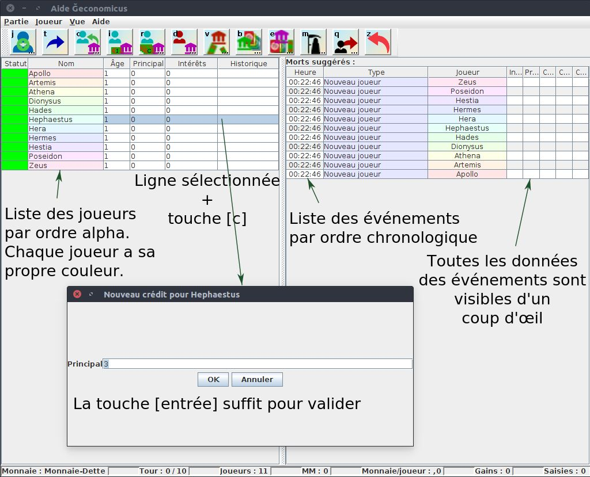

Un programme pour aider à animer les jeux Ğeconomicus, y compris pour le banquier.

# Introduction

L'utilisation est simple :

- lancer le programme,
- choisir une partie existante ou créer une nouvelle partie,
- enregistrer les joueurs,
- en monnaie libre, une fenêtre supplémentaire montre les couleurs des valeurs fortes et faibles en cours, pour être affichées sur un écran pour les joueurs par exemple (la rotation est automatique à chaque tour mais peut aussi être déclenchée manuellement),
- en monnaie dette, enregistrer les interactions du banquier avec les joueurs (crédits, remboursements, défauts, etc),
- gérer le renouvellement des générations (le programme conseille les renaissances en fonction du nombre de tours prévus et du nombre de joueurs) et la comptabilisation des valeurs accumulées par les joueurs,
- en fin de partie, collecter les créations de valeur de la banque et des joueurs,
- un autre programme se charge d'afficher des statistiques en comparant potentiellement plusieurs parties (idéalement avec les mêmes joueurs dans différentes monnaies).

L'accent est mis sur la rapidité d'utilisation avec des boutons accessibles (les actions sont également accessibles via des menus) et surtout des raccourcis clavier permettant d'effectuer les actions rapidement (un simple remboursement d'intérêts se fait en une touche, un nouveau crédit par défaut en 2 touches).
Le tout est sauvegardé en temps réel dans une base de données locale en cas de crash et est exportable en XML (il serait aussi facile d'exporter du CSV pour les inconditionnels d'imports dans des tableurs).

# Présentation des écrans

Choix d'ouvrir une partie existante :

Ou bien créer une partie dans la même boîte de dialogue :

En créant une partie, on se retrouve avec un écran vide, mais déjà avec plein d'indications :

Les différents boutons indiquent les actions disponibles (mis à part quelques unes disponibles uniquement par menu car peu courantes - fin de partie, import/export, changement de description de la partie, rupture technologique). Les raccourcis clavier fonctionnent partout dans l'écran (pas de Ctrl ou Alt, c'est directement la touche concernée qui déclenche l'action), attention si vous avez un chat qui se balade près de l'ordi, il pourrait jouer la partie à lui tout seul !
Une barre de statut en bas de l'écran est mise à jour en temps réel et donne des indications importantes sur la partie, masse monétaire, nombre de tours, etc.

En début de partie, on ajoute les différents joueurs, en appuyant simplement sur [j], on tape leur nom puis [entrée]. Ensuite, il suffit de se balader avec les flèches dans la liste ou de sélectionner le joueur désiré et d'appuyer sur la touche [c] pour indiquer que la banque lui octroie un crédit puis [entrée] directement s'il s'agit d'un crédit de 3 (par défaut) :

Dans la partie de droite apparaissent les différentes actions effectuées dans l'ordre chronologique inverse (le plus récent est en haut, ce qui fait que les plus vieux disparaissent ensuite en bas de l'écran, mais ça reste scrollable bien sûr).
On peut aussi renommer un joueur en cours de route au besoin en double-cliquant sur son nom.
Des joueurs peuvent entrer en cours de partie, ou bien sortir de la partie avant la fin (les impondérables arrivent !).

Pour signaler la fin d'un tour, une simple pression sur la touche [t] suffit.

La liste des joueurs est triée par statut puis par ordre alphabétique. Le statut peut être rouge (le joueur doit passer voir la banque), gris (le joueur est en faillite personnelle ou en prison, il passe son tour), ou vert. Une chaîne de caractères en code indique d'un coup d'œil les différentes actions du joueur depuis sa dernière naissance :

- M pour la mort,
- +3 indique un crédit de 3,
- puis +3/1/1 indique par exemple qu'il a remboursé deux fois un intérêt de 1,
- D indique un défaut,
- R un remboursement et un point indique la fin du crédit.

On peut donc voir d'un coup d'œil si un joueur a déjà pris un crédit auparavant et comment ça s'est terminé… Ben oui, un banquier c'est omniscient, non ?

Le programme suggère également quel(s) joueur(s) doi(ven)t mourir à ce tour pour que tous soient renouvelés avant la fin du jeu. Il reste de la responsabilité de l'animateur de provoquer ces morts lui-même.

